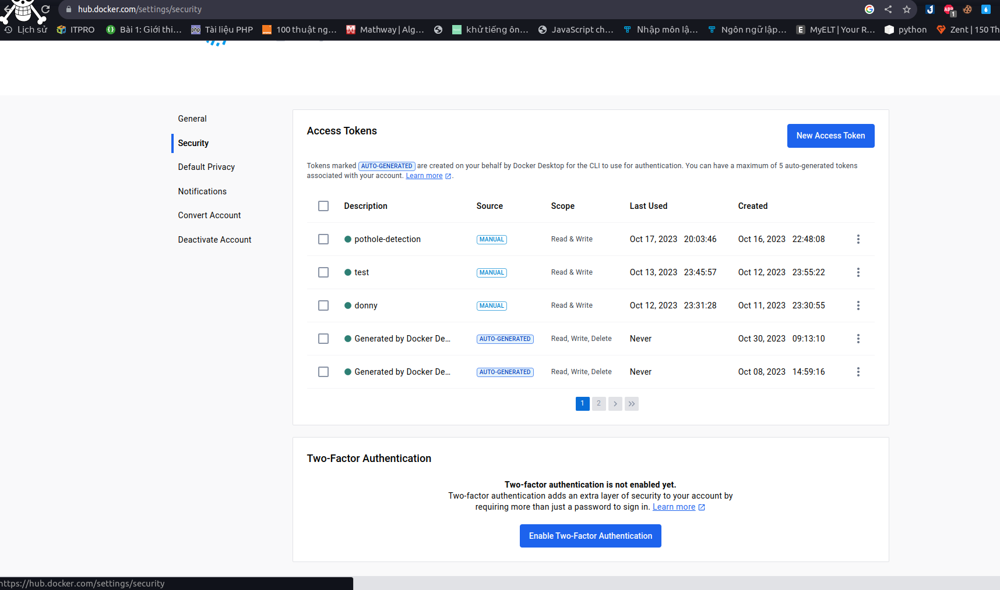

# POTHOLE PREDICTION 

## ARCHITECHTURE:


## Note:
+ **jenkins_docker** folder: deploy jenkins using docker
+ **monitoring_docker** folder: deploy observable systems using docker
+ **service_k8s** folder: deploy service using k8s
    + **pothole-prediction_chart** folder: using  ingress gateway + virtual service to access to pothole-prediction service in the cluster
    + **nginx-ingress** folder: using to istall nginx
    + **service_ingress** folder: using nginx ingress to access to pothole-prediction service in the cluster
    + **service_wo_ingress** foler: using loadbalancer to access to pothole-prediction service in the cluster

## 1. Installation
+ Tested on Python 3.8 (here i use Conda environment)
+ Install requirements: ```pip install -r requirement.txt```
+ EDA + Modeling + Training code: You can refer [Here](https://learnopencv.com/train-yolov8-on-custom-dataset/) ... sorry I can only give you a few commands for training :v because my computer is quite weak
+ Data: [pothole datasets](https://www.dropbox.com/s/qvglw8pqo16769f/pothole_dataset_v8.zip?dl=1-Opothole_dataset_v8.zip)
+ Docker engine
+ Docker images:
    + [daockbn/pothole-predict-fastapi:1.1](https://hub.docker.com/layers/daockbn/pothole-predict-fastapi/1.1/images/sha256-b809599c9bd97e917265df36d4f30e7ac3d960bdc6e1e8197b9e28737bacf858?context=repo): Image i built
    + [fullstackdatascience/jenkins:lts](https://hub.docker.com/r/fullstackdatascience/jenkins/tags): build Jenkins service
    + [fullstackdatascience/jenkins-k8s/lts](https://hub.docker.com/r/fullstackdatascience/jenkins-k8s): build Jenkins service + Helm
## 2. Fastapi
### How to guide
+ ```uvicorn main:app --host 0.0.0.0 --port 8000 --reload``` or ```docker pull daockbn/pothole-predict-fastapi:1.1 && docker run -p 8000:8000 daockbn/pothole-predict-fastapi:1.1```
+ And then
+ ```ngrok http 8000```

## 3. observable systems
I have a service, we need some observable systems to monitoring our service. In this repo, we suggest Elastic Search, Grafana, Prometheus and Jaeger.
### Observable systems architecture

### 3.1. Elastic Search
#### How to guide
+ ```cd observable_systems/elk```
+ ```docker compose -f elk-docker-compose.yml -f extensions/filebeat/filebeat-compose.yml up -d```
+ You can access kibana at port 5601 to search logs, which FileBeat pulls logs from containers and pushes to ElasticSearch. Username and password of Kibana can be found at ```observable-systems/elk/.env```

### 3.2. Prometheus + Grafana + Jaeger for monitoring resources and apps
#### How to guide
+ ```cd observable-systems```
+ ```docker compose -f prom-graf-docker-compose.yaml up -d```
+ ```python observable-systems/instrument/metrics/metrics.py```


+ ```python observable-systems/instrument/traces/trace_automatic.py```
+ Access to Prometheus, Grafana, Jaeger and enjoy!!!
+ Then, you can access Prometheus at port 9090, Grafana at 3001 and Jaeger at 16686. Username and password of Grafana is admin.
#### 3.2.1. Prometheus

+ In Prometheus UI, you can search any metrics what you want to monitor and click on the button that i highlighted border to list all metrics prometheus scraping
#### 3.2.2. Grafana
When you access to Grafana, you can create your own dashboard to monitoring or use a template on Grafana Labs

You can monitor node's resource usage and application on your own as i did below.


Throughout monitoring resources, you can set alerting rule for Alert-Manager to warning whenever resources usage is exceed some predefined alerting rule.
Alerting rule and webhook you can define in ```alertmanager/config.yml```. In my repo, whenever avalable memory of node is smaller than 5% and cpu usage of jenkins container is greater than 2%, Alert-Manager will send warning to my discord.

#### 3.3.3. Jaeger
Last but not least, sometimes you need to trace some block code processing time, Jaeger will help you do that.

In Jaeger UI, all block code that you want to trace time will be displayed on right hand sides.(Here I use trace automation).
### 4. Jenkins
#### How to guide

+ ```docker compose -f jenkins/docker-compose.yml up -d```

+ Jenkins service was exposed at port 8081, we can access by this port

+ Connect to github repo using ngrok. if 200 OK, you have already connect jenkins to github.


Additionally, in **Let me select individual events** in **Setting/Webhooks/Manage webhook**, tick **Pull requests** and **Pushes** to inform jenkins start to run whenever we push or pull code from github.


+ Access to Jenkins, click **New Item** to create new **Multibranch Pipeline**


+ In **Configuration/Branch Sources**, choose **GitHub** in **Add source**


+ Then click **Add**, choose multibranch pipeline has created to configure github account


+ After that, in **Credentials**, click **global** in **Stores scoped**, then click **Add Credentials** to add Docker Hub account.


Username is username of docker hub and password that we set in docker hub.



+ Whenever code is push to github or pull from github, Jenkins will take care all of this

+ Enjoy achivement!!!

## 5. Google Kubernetes Engine

+ Before moving on to the next section, you need to have an active Google Cloud Platform account, install gcloud CLI according to this link https://cloud.google.com/sdk/docs/install#deb, authenticate with GCP by using this command ```gcloud auth application-default login``` and create **service account file** by using this file [prepare/Prepare_ansible.pdf](prepare/Prepare_ansible.pdf) for later used by ansible
+ Here you can install Docker , app , bla bla to VM with ansible ( i will update later) so currently i only guide deploy to GKE manual :v

### 5.1. GKE Deploy Manual
#### How to guide

+ ```cd iac/terraform```

+ ```terraform init```

+ ```terraform plan```

+ ```terraform apply```. Note, GKE was created by terraform will be in autopilot mode.


+ After creating you command ```kubectx ``` and choose ```gke_pothole_detection-402408...```


+ Then ```cd nginx-ingress```
  + ```kubectl create ns nginx-ingress```
  + ```kubens nginx-ingress```
  + ```helm upgrade --install nginx-ingress-controller .``` 
+ Now we have Ingress for connect to GKE 


+ And then you select ```cd service_ingress```

+ After that, create namespace have name is "model-serving" by ```kubectl create ns model-serving``` and ```kubens model-serving```
+ You need upgrade or install service with name "pothole-prediction" ```helm upgrade --install pothole-prediction```
+ ```sudo vim /etc/hosts``` to modify nginx ingress address to access to service, in my case is **34.41.88.26   pothole-prediction.example.com**
+ Final , you can see address or hosts by ```kubectl get ing```


+ Copy and paste this host to url 


+ Now you can upload images to detect potholes in two ways: export to Json or image:
 

+ Here are the details I deploy.


## So I have completed deploying the model to GKE manually. I will update the automatic deployment of CI/CDpipeline and monitoring to GKE later :<                                      If there is anything wrong, please comment. Thank you all!

